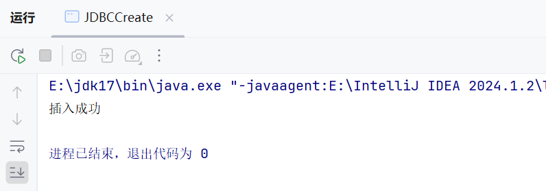
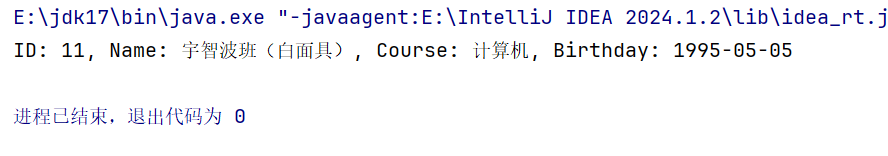
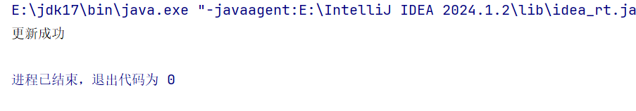
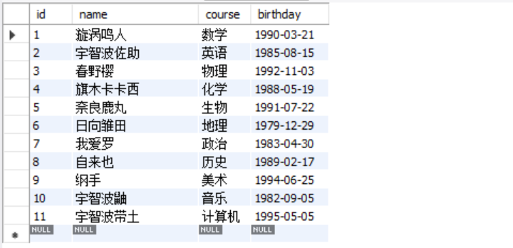
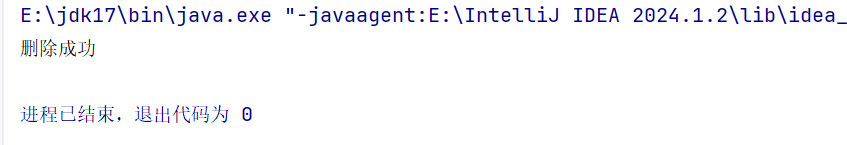
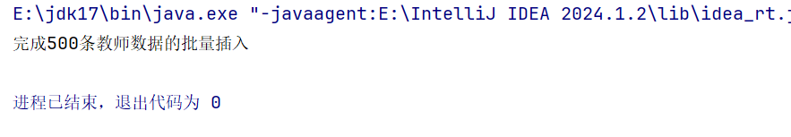
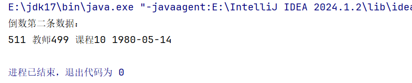

#### 建表语句如下：

```mysql
-- 创建数据库
CREATE DATABASE IF NOT EXISTS JDBCtest;
USE JDBCtest;

-- 创建表 
CREATE TABLE teacher (
  id int NOT NULL AUTO_INCREMENT COMMENT 'id',
  name varchar(255) DEFAULT NULL COMMENT '姓名',
  course varchar(255) DEFAULT NULL COMMENT '课程',
  birthday date DEFAULT NULL COMMENT '生日',
  PRIMARY KEY (id)
);

-- 插入数据
INSERT INTO `teacher` VALUES ('1', '漩涡鸣人', '数学', '1990-03-21');
INSERT INTO `teacher` VALUES ('2', '宇智波佐助', '英语', '1985-08-15');
INSERT INTO `teacher` VALUES ('3', '春野樱', '物理', '1992-11-03');
INSERT INTO `teacher` VALUES ('4', '旗木卡卡西', '化学', '1988-05-19');
INSERT INTO `teacher` VALUES ('5', '奈良鹿丸', '生物', '1991-07-22');
INSERT INTO `teacher` VALUES ('6', '日向雏田', '地理', '1979-12-29');
INSERT INTO `teacher` VALUES ('7', '我爱罗', '政治', '1983-04-30');
INSERT INTO `teacher` VALUES ('8', '自来也', '历史', '1989-02-17');
INSERT INTO `teacher` VALUES ('9', '纲手', '美术', '1994-06-25');
INSERT INTO `teacher` VALUES ('10', '宇智波鼬', '音乐', '1982-09-05');
```

#### 要求：

1. ##### 完成teacher的CRUD练习，提供CRUD的代码。

   ```java
   // 插入操作
   import java.sql.*;
   
   public class JDBCCreate {
   
       static final String NAME = "宇智波班（白面具）"; // 后多插入"宇智波止水"
       static final String COURSE = "计算机"; //  后多插入"美术"
       static final Date BIRTHDAY = Date.valueOf("1995-05-05"); // 后多插入"1995-12-12"
       static final String URL = "jdbc:mysql://localhost:3306/JDBCtest?serverTimezone=GMT&characterEncoding=UTF-8";
       static final String USER = "root";
       static final String PASSWORD = "123456789";
       static final String SQL = "INSERT INTO teacher(name, course, birthday) VALUES(?, ?, ?)";
   
       public static void main(String[] args) {
           try {
               Class.forName("com.mysql.cj.jdbc.Driver");
           } catch (ClassNotFoundException e) {
               throw new RuntimeException(e);
           }
   
           try (Connection conn = DriverManager.getConnection(URL, USER, PASSWORD)) {
               conn.setAutoCommit(false);
   
               // 查询当前最大ID
               String queryMaxIdSQL = "SELECT MAX(id) AS max_id FROM teacher";
               try (Statement stmt = conn.createStatement(); ResultSet rs = stmt.executeQuery(queryMaxIdSQL)) {
                   if (rs.next()) {
                       int maxId = rs.getInt("max_id");
   
                       // 重置AUTO_INCREMENT值
                       String resetAutoIncrementSQL = "ALTER TABLE teacher AUTO_INCREMENT = ?";
                       try (PreparedStatement resetPs = conn.prepareStatement(resetAutoIncrementSQL)) {
                           resetPs.setInt(1, maxId + 1);
                           resetPs.executeUpdate();
                       }
                   }
               }
   
               try (PreparedStatement ps = conn.prepareStatement(SQL)) {
                   ps.setString(1, NAME);
                   ps.setString(2, COURSE);
                   ps.setDate(3, BIRTHDAY);
                   ps.executeUpdate();
                   conn.commit();
                   System.out.println("插入成功");
               } catch (SQLException e) {
                   conn.rollback();
                   throw new RuntimeException(e);
               } finally {
                   conn.setAutoCommit(true);
               }
           } catch (SQLException e) {
               throw new RuntimeException(e);
           }
       }
   }
   ```

   ###### Create操作实现效果如下：

   

   ###### MySQL查看效果：

   

   

   ```java
   // 查询操作
   public class JDBCRetrieve {
   
       static final Integer ID = 11;
       static final String URL = "jdbc:mysql://localhost:3306/JDBCtest?serverTimezone=GMT&characterEncoding=UTF-8";
       static final String USER = "root";
       static final String PASSWORD = "123456789";
       static final String SQL = "SELECT id, name, course, birthday FROM teacher WHERE id = ?";
   
       public static void main(String[] args) {
           try {
               Class.forName("com.mysql.cj.jdbc.Driver");
           } catch (ClassNotFoundException e) {
               throw new RuntimeException(e);
           }
   
           try (Connection conn = DriverManager.getConnection(URL, USER, PASSWORD)) {
               try (PreparedStatement ps = conn.prepareStatement(SQL)) {
                   ps.setInt(1, ID);
                   try (ResultSet rs = ps.executeQuery()) {
                       while (rs.next()) {
                           System.out.println("ID: " + rs.getInt("id") +
                                   ", Name: " + rs.getString("name") +
                                   ", Course: " + rs.getString("course") +
                                   ", Birthday: " + rs.getDate("birthday"));
                       }
                   }
               }
           } catch (SQLException e) {
               throw new RuntimeException(e);
           }
       }
   }
   ```

   ###### Retrieve操作实现效果如下：

   

   

   ```java
   // 更新操作
   import java.sql.*;
   
   public class JDBCUpdate {
   
       static final Integer ID = 11;
       static final String NAME = "宇智波带土";
       static final String URL = "jdbc:mysql://localhost:3306/JDBCtest?serverTimezone=GMT&characterEncoding=UTF-8";
       static final String USER = "root";
       static final String PASSWORD = "123456789";
       static final String SQL = "UPDATE teacher SET name = ? WHERE id = ?";
   
       public static void main(String[] args) {
           try {
               Class.forName("com.mysql.cj.jdbc.Driver");
           } catch (ClassNotFoundException e) {
               throw new RuntimeException(e);
           }
   
           try (Connection conn = DriverManager.getConnection(URL, USER, PASSWORD)) {
               conn.setAutoCommit(false);
               try (PreparedStatement ps = conn.prepareStatement(SQL)) {
                   ps.setString(1, NAME);
                   ps.setInt(2, ID);
                   ps.executeUpdate();
                   conn.commit();
                   System.out.println("更新成功");
               } catch (SQLException e) {
                   conn.rollback();
                   throw new RuntimeException(e);
               } finally {
                   conn.setAutoCommit(true);
               }
           } catch (SQLException e) {
               throw new RuntimeException(e);
           }
       }
   }
   ```

   ###### Update操作实现效果如下：

   

   ###### MySQL查看效果：

   

   

   ```java
   // 删除操作
   import java.sql.*;
   
   public class JDBCDelete {
   
       static final Integer ID = 11;
       static final String URL = "jdbc:mysql://localhost:3306/JDBCtest?serverTimezone=GMT&characterEncoding=UTF-8";
       static final String USER = "root";
       static final String PASSWORD = "123456789";
       static final String SQL = "DELETE FROM teacher WHERE id = ?";
   
       public static void main(String[] args) {
           try {
               Class.forName("com.mysql.cj.jdbc.Driver");
           } catch (ClassNotFoundException e) {
               throw new RuntimeException(e);
           }
   
           try (Connection conn = DriverManager.getConnection(URL, USER, PASSWORD)) {
               conn.setAutoCommit(false);
               try (PreparedStatement ps = conn.prepareStatement(SQL)) {
                   ps.setInt(1, ID);
                   ps.executeUpdate();
                   conn.commit();
                   System.out.println("删除成功");
               } catch (SQLException e) {
                   conn.rollback();
                   throw new RuntimeException(e);
               } finally {
                   conn.setAutoCommit(true);
               }
           } catch (SQLException e) {
               throw new RuntimeException(e);
           }
       }
   }
   ```

   *在此处在插入一个新数据：*

   

   ###### Delete操作实现效果如下：

   

   ###### MySQL查看效果：

   

   

2. 完成teacher表的批量插入练习，插入500个教师，每插入100条数据提交一次。

   ```java
   // 批量添加
   import java.sql.*;
   
   public class JDBCBatchAdd {
   
       static final String URL = "jdbc:mysql://localhost:3306/JDBCtest?serverTimezone=GMT&characterEncoding=UTF-8";
       static final String USER = "root";
       static final String PASSWORD = "123456789";
       static final String SQL = "INSERT INTO teacher(name, course, birthday) VALUES(?, ?, ?)";
   
       public static void main(String[] args) {
           try {
               // 注册驱动程序
               Class.forName("com.mysql.cj.jdbc.Driver");
           } catch (ClassNotFoundException e) {
               throw new RuntimeException(e);
           }
   
   
           try (Connection conn = DriverManager.getConnection(URL, USER, PASSWORD)) {
               conn.setAutoCommit(false);
   
               // 查询当前最大ID
               String queryMaxIdSQL = "SELECT MAX(id) AS max_id FROM teacher";
               try (Statement stmt = conn.createStatement(); ResultSet rs = stmt.executeQuery(queryMaxIdSQL)) {
                   if (rs.next()) {
                       int maxId = rs.getInt("max_id");
   
                       // 重置AUTO_INCREMENT值
                       String resetAutoIncrementSQL = "ALTER TABLE teacher AUTO_INCREMENT = ?";
                       try (PreparedStatement resetPs = conn.prepareStatement(resetAutoIncrementSQL)) {
                           resetPs.setInt(1, maxId + 1);
                           resetPs.executeUpdate();
                       }
                   }
               }
   
               try (PreparedStatement ps = conn.prepareStatement(SQL)) {
   
                   for (int i = 1; i <= 500; i++) {
                       ps.setString(1, "教师" + i);
                       ps.setString(2, "课程" + (i % 10 + 1)); // 课程名称变化
                       ps.setDate(3, Date.valueOf(Date.valueOf("1980-01-01").toLocalDate().plusDays(i % 365))); // 模拟生日
   
                       ps.addBatch();
   
                       // 每插入100条数据执行并清空批处理
                       if (i % 100 == 0) {
                           ps.executeBatch();
                           conn.commit();
                           ps.clearBatch();
                       }
                   }
   
                   // 执行剩余未提交的数据
                   ps.executeBatch();
                   conn.commit();
                   System.out.println("完成500条教师数据的批量插入");
   
               } catch (SQLException e) {
                   conn.rollback();
                   throw new RuntimeException(e);
               } finally {
                   conn.setAutoCommit(true);
               }
           } catch (SQLException e) {
               throw new RuntimeException(e);
           }
       }
   }
   ```

   ###### 批量插入操作实现效果如下：

   

   ###### MySQL查看效果：

   

   

   

3. 完成可滚动的结果集练习，只查看结果集中倒数第2条数据。

   ```java
   // 可滚动结果集
   import java.sql.*;
   
   public class JDBCScrollResultSet {
   
       static final String URL = "jdbc:mysql://localhost:3306/JDBCtest?serverTimezone=GMT&characterEncoding=UTF-8";
       static final String USER = "root";
       static final String PASSWORD = "123456789";
       static final String SQL = "SELECT id, name, course, birthday FROM teacher";
   
       public static void main(String[] args) {
   
           Connection conn = null;
           PreparedStatement ps = null;
           ResultSet rs = null;
   
           try {
               // 注册驱动程序
               Class.forName("com.mysql.cj.jdbc.Driver");
               // 建立数据库连接
               conn = DriverManager.getConnection(URL, USER, PASSWORD);
               // 准备SQL语句，设置可滚动和只读
               ps = conn.prepareStatement(SQL, ResultSet.TYPE_SCROLL_INSENSITIVE, ResultSet.CONCUR_READ_ONLY);
               // 执行SQL语句
               rs = ps.executeQuery();
   
               // 移动到倒数第二行并输出
               if (rs.last()) { // 移动到最后一行
                   System.out.println("倒数第二条数据：");
                   rs.absolute(-2); // 移动到倒数第二行
                   System.out.println(rs.getInt("id") + " " + rs.getString("name") + " " + rs.getString("course") + " " + rs.getDate("birthday"));
               }
   
           } catch (SQLException e) {
               throw new RuntimeException(e);
           } catch (ClassNotFoundException e) {
               throw new RuntimeException(e);
           } finally {
               if (rs != null) {
                   try {
                       rs.close();
                   } catch (SQLException e) {
                       e.printStackTrace();
                   }
               }
   
               if (ps != null) {
                   try {
                       ps.close();
                   } catch (SQLException e) {
                       e.printStackTrace();
                   }
               }
   
               if (conn != null) {
                   try {
                       conn.close();
                   } catch (SQLException e) {
                       e.printStackTrace();
                   }
               }
           }
       }
   }
   ```

   ###### 可滚动结果集操作实现效果如下：

   