### 1. 会话安全性（该部分简易代码放在了文末）

#### 1.1 会话劫持和防御

会话劫持是指攻击者通过窃取用户的会话令牌，冒充用户进行操作。常见的攻击手段包括：

- **网络监听**：在不安全的网络中，攻击者可以使用网络嗅探工具捕获未加密的会话令牌。
- **跨站请求伪造（CSRF）**：通过伪造请求来利用用户的有效会话。

**防御措施**：

- **使用HTTPS**：加密传输可以有效防止会话令牌被窃取。
- **定期更换会话ID**：用户每次登录或在一定时间后更换会话ID，减少会话被劫持的风险。
- **会话超时**：设置合理的会话超时时间，避免长时间有效的会话。
- **同源策略**：限制不同域之间的交互，减少被攻击的可能性。

#### 1.2 跨站脚本攻击（XSS）和防御

XSS攻击通过注入恶意脚本，使得攻击者能够在用户浏览器中执行任意代码。攻击者可以窃取cookie、会话令牌或进行其它恶意操作。

**防御措施**：

- **输入输出编码**：对用户输入进行严格的过滤和编码，防止脚本被执行。HTML、JavaScript和URL都要进行相应的编码。
- **内容安全策略（CSP）**：通过设置CSP，限制页面加载的资源来源，防止恶意脚本的执行。
- **安全的JavaScript API**：使用安全的API来处理动态内容，减少XSS攻击的机会。
- **代码审查**：定期审查和测试代码，查找和修复潜在的XSS漏洞。

#### 1.3 跨站请求伪造（CSRF）和防御

CSRF攻击是通过伪造用户请求，使得用户在不知情的情况下执行操作。

**防御措施**：

- **CSRF令牌**：每个请求附带一个不可预测的令牌，服务器验证这个令牌来确认请求的合法性。
- **请求来源验证**：检查请求的来源，确保请求是来自合法的页面。
- **使用SameSite Cookie属性**：设置Cookie的SameSite属性，以减少CSRF攻击的风险。

### 2. 分布式会话管理

#### 2.1 分布式环境下的会话同步问题

在分布式系统中，用户的会话状态需要在多个节点间保持一致性。这导致了会话同步的问题，常见的挑战包括：

- **延迟**：在多个节点间同步会话信息可能引入延迟。
- **数据一致性**：保证所有节点上会话信息的一致性，避免出现不一致的状态。

#### 2.2 Session集群解决方案

为了解决会话同步问题，可以采用以下几种集群解决方案：

- **Session复制**：在每个节点上保持会话的副本。当会话信息更新时，所有节点都进行同步更新。这种方式能提供较好的数据一致性，但会增加网络流量和处理延迟。
- **Session分片**：将会话信息分散存储在不同的节点上，每个节点只负责一部分会话。这种方式可以减轻单个节点的负担，但可能导致会话访问复杂性增加。

#### 2.3 使用Redis等缓存技术实现分布式会话（Redis的简易使用放在了文末)

使用Redis等内存数据存储技术，可以高效地管理分布式会话：

- **快速访问**：Redis提供高性能的读写操作，适合存储会话信息。
- **持久化**：可以将会话信息持久化到磁盘，防止数据丢失。
- **数据结构丰富**：Redis支持多种数据结构（如哈希、列表），可以灵活地存储和管理会话数据。

### 3. 会话状态的序列化和反序列化

#### 3.1 会话状态的序列化和反序列化

序列化是将对象转换为可存储或传输的格式，反序列化则是将其还原为原始对象。对于会话管理，序列化可以将会话状态保存到数据库或缓存中，便于跨服务器共享。

#### 3.2 为什么需要序列化会话状态

- **分布式存储**：在分布式环境中，需要将会话状态在不同节点间传递和共享。
- **持久化存储**：会话状态可以在服务器重启或故障后恢复。
- **高效传输**：通过序列化，可以将会话状态以字节流的形式高效传输。

#### 3.3 Java对象序列化

Java通过实现`Serializable`接口，实现对象的序列化。可以使用`ObjectOutputStream`和`ObjectInputStream`来进行序列化和反序列化。

```java
import java.io.*;

public class UserSession implements Serializable {
    private String userId;
    private String sessionId;

    // getters and setters

    public static void main(String[] args) {
        try {
            // 序列化
            UserSession session = new UserSession();
            session.setUserId("user123");
            session.setSessionId("session456");
            FileOutputStream fileOut = new FileOutputStream("session.ser");
            ObjectOutputStream out = new ObjectOutputStream(fileOut);
            out.writeObject(session);
            out.close();
            fileOut.close();

            // 反序列化
            FileInputStream fileIn = new FileInputStream("session.ser");
            ObjectInputStream in = new ObjectInputStream(fileIn);
            UserSession deserializedSession = (UserSession) in.readObject();
            in.close();
            fileIn.close();
        } catch (IOException | ClassNotFoundException e) {
            e.printStackTrace();
        }
    }
}
```

#### 自定义序列化策略

可以通过实现`writeObject`和`readObject`方法，自定义序列化和反序列化的过程。例如，可以在序列化时加密某些敏感字段，或在反序列化时进行数据校验。


### 示例代码：

#### XSS防御(示例代码如下)

```java
package com.gzu;

import javax.servlet.ServletException;
import javax.servlet.annotation.WebServlet;
import javax.servlet.http.HttpServlet;
import javax.servlet.http.HttpServletRequest;
import javax.servlet.http.HttpServletResponse;
import java.io.IOException;
import java.io.PrintWriter;

@WebServlet("/submit")
public class SubmitServlet extends HttpServlet {
    protected void doGet(HttpServletRequest request, HttpServletResponse response)
            throws ServletException, IOException {
        // 设置请求和响应的编码
        request.setCharacterEncoding("UTF-8");
        response.setCharacterEncoding("UTF-8");
        response.setContentType("text/html; charset=UTF-8");

        // 输入数据测试
        PrintWriter out = response.getWriter();
        out.println("<html><body>");
        out.println("<h1>数据测试</h1>");
        out.println("<form method='POST' action='/SessionTest/submit'>"
                + "<label for='input'>输入数据：</label>"
                + "<input type='text' name='data' id='input' required/>"
                + "<input type='submit' value='提交'/>"
                + "</form>");
        out.println("</body></html>");
    }

    protected void doPost(HttpServletRequest request, HttpServletResponse response)
            throws ServletException, IOException {
        // 设置请求和响应的编码
        request.setCharacterEncoding("UTF-8");
        response.setCharacterEncoding("UTF-8");
        response.setContentType("text/html; charset=UTF-8");

        // 获取输入数据
        String userInput = request.getParameter("data");

        // 防止XSS攻击
        String safeInput = escapeHtml(userInput);

        PrintWriter out = response.getWriter();
        out.println("<html><body>");
        out.println("<h1>你的输入:</h1>");
        out.println("<p>" + escapeHtml(safeInput) + "</p>");
        out.println("</body></html>");
    }

    private String escapeHtml(String input) {
        System.out.println(("我拿到了数据：" + input));
        if (input == null) return null;
        String safeInput = input.replace("&", "&amp;")
                .replace("<", "&lt;")
                .replace(">", "&gt;")
                .replace("\"", "&quot;")
                .replace("'", "&#x27;");
        System.out.println("脚本防御成功：" + safeInput);
        return safeInput;
    }
}
```

##### 该代码运行结果如下：

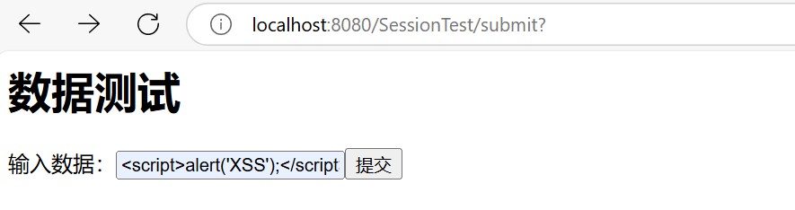

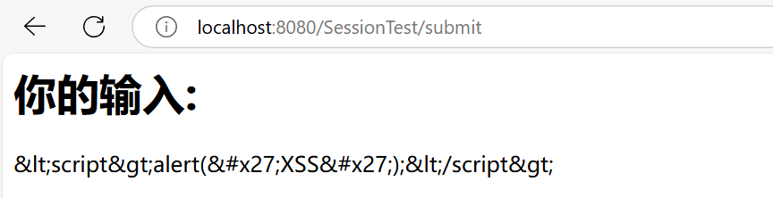

此处为idea终端表示的内容，虽然不知道为什么在页面中需要转义两次，但在idea中，第一次转义就已经完成了，为了在网页中显示出转义结果，于是我在
        `PrintWriter out = response.getWriter();`
        `out.println("<html><body>");`
        `out.println("<h1>你的输入:</h1>");`
        `out.println("<p>" + escapeHtml(safeInput) + "</p>");`
        `out.println("</body></html>");`

该输出部分进行了第二次转义

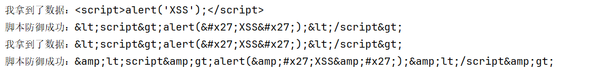


#### CSRF防御(示例代码如下)

```java
package com.gzu;

import javax.servlet.ServletException;
import javax.servlet.annotation.WebServlet;
import javax.servlet.http.HttpServlet;
import javax.servlet.http.HttpServletRequest;
import javax.servlet.http.HttpServletResponse;
import javax.servlet.http.HttpSession;
import java.io.IOException;

@WebServlet("/form")
public class FormServlet extends HttpServlet {
    protected void doGet(HttpServletRequest request, HttpServletResponse response)
            throws ServletException, IOException {
        // 设置请求和响应的编码
        request.setCharacterEncoding("UTF-8");
        response.setCharacterEncoding("UTF-8");
        response.setContentType("text/html; charset=UTF-8");

        // 设置固定的 CSRF 令牌为 "111" 用于测试
        String csrfToken = "111";
        HttpSession session = request.getSession();
        session.setAttribute("csrfToken", csrfToken);

        // 输入数据测试
        response.getWriter().println("<form method='POST' action='/SessionTest/form'>"
                + "<label for='input'>输入数据：</label>"
                + "<input type='text' name='data'/>"
                + "<input type='submit' value='提交'/>"
                + "</form>");
    }

    protected void doPost(HttpServletRequest request, HttpServletResponse response)
            throws ServletException, IOException {
        // 设置请求和响应的编码
        request.setCharacterEncoding("UTF-8");
        response.setCharacterEncoding("UTF-8");
        response.setContentType("text/html; charset=UTF-8");

        HttpSession session = request.getSession();
        String sessionToken = (String) session.getAttribute("csrfToken");

        // 获取输入数据
        String data = request.getParameter("data");

        if (sessionToken != null && sessionToken.equals(data)) {
            response.getWriter().println("提交的数据是：" + data + "，有效的CSRF令牌");
            System.out.println("提交的数据是：" + data + "，有效的CSRF令牌");
        } else {
            response.getWriter().println(data + "无效的CSRF令牌。");
            System.out.println(data + "无效的CSRF令牌。");
    }
}
```

在代码中我为了测试CSRF令牌，于是将CSRF令牌设置为默认值111，以便后续进行测试。在实际项目中，可以使用 Java 的 `SecureRandom` 类来生成随机的 CSRF 令牌进行测试

##### 该代码运行结果如下：

##### 成功案例：

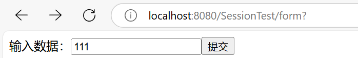

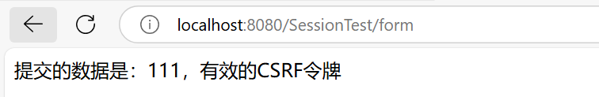

idea终端输出为：


##### 失败案例：

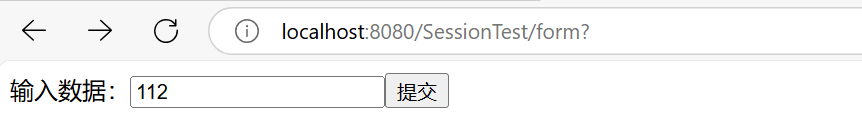

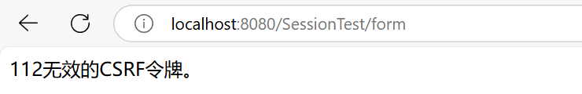

idea终端输出为：


#### Redis数据库的简易使用：

由于Redis的官网上并不推荐在Windows上使用Redis，于是我在github上找到大佬们做好的包用于部署测试

##### 启动Redis服务并使用

在cmd中输入`redis-server.exe redis.windows.conf`用于启动Redis服务

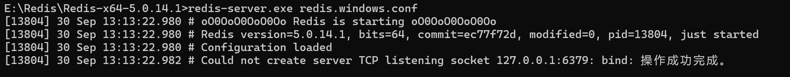

使用命令`redis-cli.exe -h 127.0.0.1 -p 6379`启动客户端，并在命令中输入ping命令来检测redis服务器与redis客户端的连通性，返回`PONG`则说明连接成功了

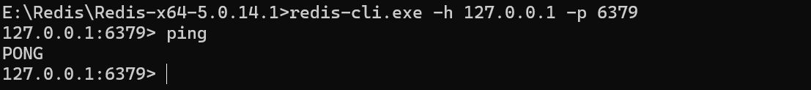

使用一些基本操作进行测试

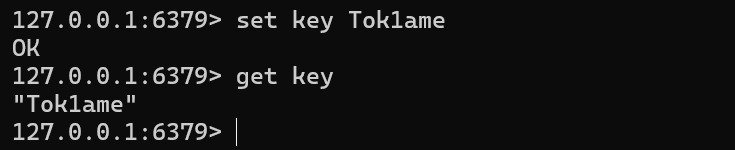

在idea中也可以进行Redis使用（示例代码如下） PS：使用时需引用jedis依赖包，如我引用的为jedis-5.1.5.jar

```java
package com.gzu;

import redis.clients.jedis.Jedis;

public class Main {
    public static void main(String[] args) {
        // 1、 创建 Jedis 对象即可
        Jedis jedis = new Jedis("127.0.0.1",6379);
        //清空当前库的所有数据
        jedis.flushDB();
        // 加入数据
        jedis.set("name","Tok1ame");
        jedis.set("age","20");
        jedis.set("high","170");
        // get 输出结果
        System.out.println("name:"+jedis.get("name")+"\nage:"+jedis.get("age")+"\nhigh"+jedis.get("high"));

        // list 列表
        jedis.lpush("list","1","2","3","4");
        System.out.println("list: "+jedis.lrange("list",0,-1));

    }
}
```

测试结果如下：

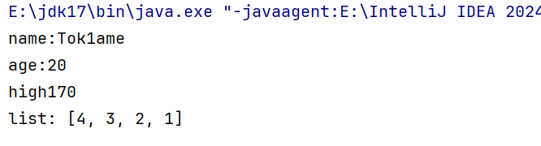
